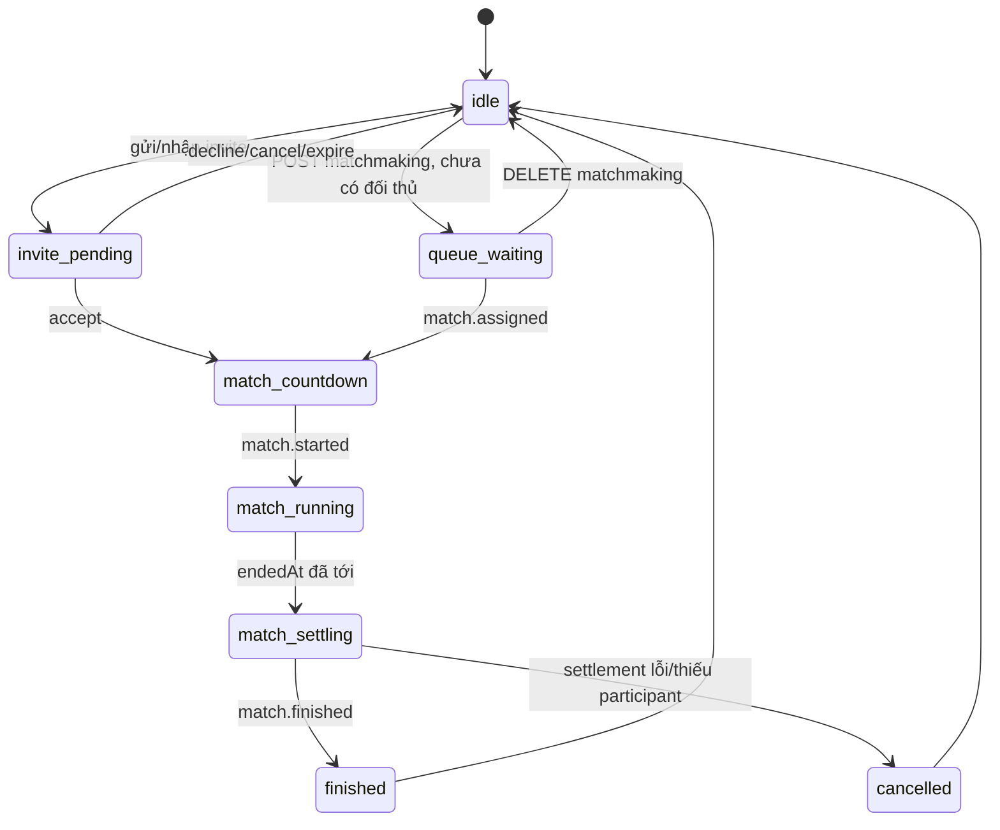

# Walkamon PvP Lumina Sprint — FE Handoff UC-67 đến UC-74

Tài liệu này mô tả contract đang có trong backend tại ngày **18/07/2026**. Mục tiêu là để FE Flutter tích hợp PvP mà không phải suy đoán state, timer, lỗi hoặc payload SignalR.

Phạm vi:

| UC | Chức năng | Owner |
|---|---|---|
| UC-67 | Invite/Receive friend | HungTV |
| UC-68 | Find opponent | HungTV |
| UC-69 | View sprint result | HungTV |
| UC-70 | View sprint history | HungTV |
| UC-71 | Claim sprint reward | HungTV |
| UC-72 | View sprint match | HungTV |
| UC-73 | View challenge invites | HungTV |
| UC-74 | Configure sprint rewards | HungTV |

Source backend chính đã đối chiếu:

- `Walkamon/Controllers/PvpSprintController.cs`
- `Walkamon/Controllers/AdminPvpSprintController.cs`
- `Walkamon/Hubs/SprintHub.cs`
- `Walkamon/BackgroundServices/PvpOutboxDispatcherService.cs`
- `BLL/Service/PvpSprintService.cs`
- `BLL/Service/PvpSprintService.Realtime.cs`
- `DAL/DTO/PvpSprintDtos.cs`

Sơ đồ đầy đủ luồng REST → transaction/outbox → SignalR → FE:


File có thể mở và chỉnh bằng draw.io: [Pvp_FE_SignalR_Lifecycle_Sequence.drawio](diagrams/Pvp_FE_SignalR_Lifecycle_Sequence.drawio).

---

## 1. Quy ước chung

### 1.1 Base URL và authentication

REST:

```text
{API_BASE_URL}/api/pvp/sprint/...
{API_BASE_URL}/api/admin/pvp/sprint/...
```

SignalR:

```text
{API_BASE_URL}/hubs/pvp-sprint
```

Lưu ý: URL hub **không có `/api`**.

Mọi Player API và hub yêu cầu JWT có role `User`. API cấu hình reward yêu cầu role `Admin`.

```http
Authorization: Bearer <JWT>
Content-Type: application/json
```

FE phải truyền **access token thuần**, không thêm chữ `Bearer ` vào kết quả của `accessTokenFactory`; thư viện SignalR sẽ tự tạo header/query phù hợp.

### 1.2 Success envelope

Các API PvP thành công đều trả HTTP `200`:

```json
{
  "success": true,
  "status": 200,
  "message": "Sprint match retrieved.",
  "data": {}
}
```

FE đọc dữ liệu nghiệp vụ trong `data`, không dùng `message` để quyết định logic.

### 1.3 Error envelope

Lỗi domain thường có dạng:

```json
{
  "success": false,
  "status": 409,
  "message": "Player already has an active PvP activity.",
  "data": null,
  "traceId": "0H..."
}
```

Một số lỗi authentication/model binding có thể chỉ có `success/message` hoặc RFC Problem Details có `title/errors`. Vì vậy FE nên parse theo thứ tự:

1. HTTP status là nguồn chính.
2. Nếu có `message`, hiển thị `message`.
3. Nếu không có, lấy `title` hoặc ghép nội dung trong `errors`.
4. Log `traceId` để BE tra lỗi, không hiển thị trace kỹ thuật cho người dùng.

Ý nghĩa status:

| HTTP | FE xử lý |
|---:|---|
| 400 | Request sai; không retry tự động. Hiển thị lỗi hoặc sửa input. |
| 401 | Token thiếu/hết hạn; refresh token hoặc đăng nhập lại rồi reconnect SignalR. |
| 403 | User không có quyền, không phải participant, không phải bạn bè hoặc sai vai trò. |
| 404 | Resource không tồn tại hoặc không còn ở state yêu cầu. Refresh màn hình. |
| 409 | Xung đột state/concurrency; gọi GET authoritative rồi cập nhật UI. Không loop retry mù. |
| 500 | Lỗi server; cho phép retry có kiểm soát và gửi `traceId` cho BE. |

### 1.4 Time, UUID và naming

- Tất cả thời gian server là ISO-8601 UTC, ví dụ `2026-07-18T04:19:33.754Z`.
- Dart luôn parse bằng `DateTime.parse(value).toUtc()`.
- UUID gửi dưới dạng chuỗi có dấu gạch ngang.
- JSON dùng `camelCase`.
- `speedMultiplierBps = 10000` nghĩa là 100%; `11000` nghĩa là 110%.
- `distanceUnits` mới là điểm phân thắng thua. `score` chỉ giữ tương thích client cũ và không nên dùng để đặt vị trí pet.

### 1.5 State machine FE phải dùng



Backend chỉ cho một user có **một PvP activity** tại một thời điểm: pending invite, queue hoặc active match. Nếu FE gửi action mới khi activity cũ còn tồn tại, backend trả `409`.

Thời lượng chuẩn:

| State | Thời lượng |
|---|---:|
| Invite pending | 60 giây |
| Human matchmaking trước bot fallback | 15 giây |
| Countdown | 5 giây |
| Running | 30 giây |
| Settling | khoảng 10 giây |

Worker chạy theo chu kỳ 1 giây nên chuyển state có thể trễ nhẹ so với timestamp. FE phải dùng `serverTime` và các mốc `countdownEndsAt`, `startedAt`, `endedAt`, `settlementEndsAt`; không tự kết luận kết quả bằng timer local.

---

## 2. Setup SignalR trên Flutter

### 2.1 Dependency

Mobile hiện chưa khai báo SignalR. Thêm:

```yaml
dependencies:
  signalr_netcore: ^1.4.4
```

Package `signalr_netcore 1.4.4` hỗ trợ JSON, WebSocket và auto reconnect. Tham khảo [package documentation](https://pub.dev/packages/signalr_netcore/versions/1.4.4) và [Microsoft SignalR authentication](https://learn.microsoft.com/aspnet/core/signalr/authn-and-authz).

### 2.2 Mẫu service kết nối

Đây là mẫu khung; FE thay `TokenStore`, state management và logger theo kiến trúc mobile hiện tại.

```dart
import 'dart:async';
import 'package:signalr_netcore/signalr_client.dart';

class PvpRealtimeService {
  PvpRealtimeService({
    required this.apiBaseUrl,
    required this.getAccessToken,
    required this.onEnvelope,
  });

  final String apiBaseUrl;
  final Future<String> Function() getAccessToken;
  final void Function(Map<String, dynamic> envelope) onEnvelope;

  HubConnection? _connection;

  static const eventNames = <String>[
    'invite.created',
    'invite.declined',
    'invite.cancelled',
    'invite.expired',
    'queue.waiting',
    'match.assigned',
    'reward.claimed',
    'match.created',
    'match.started',
    'match.progress',
    'match.finished',
    'match.item.used',
    'match.effect.applied',
    'match.effect.blocked',
    'match.effect.cleansed',
    'match.effect.expired',
  ];

  Future<void> connect() async {
    if (_connection?.state == HubConnectionState.Connected) return;

    final options = HttpConnectionOptions(
      accessTokenFactory: () async => getAccessToken(),
    );

    final connection = HubConnectionBuilder()
        .withUrl('$apiBaseUrl/hubs/pvp-sprint', options: options)
        .withAutomaticReconnect(
          retryDelays: <int?>[0, 2000, 5000, 10000, 30000, null],
        )
        .build();

    for (final eventName in eventNames) {
      connection.on(eventName, (arguments) {
        if (arguments == null || arguments.isEmpty) return;
        final raw = arguments.first;
        if (raw is! Map) return;
        onEnvelope(Map<String, dynamic>.from(raw));
      });
    }

    connection.onclose(({error}) {
      // Đánh dấu UI offline. Không tự đổi kết quả trận.
    });

    _connection = connection;
    await connection.start();
  }

  Future<void> joinMatch(String matchId) async {
    final connection = _connection;
    if (connection?.state != HubConnectionState.Connected) {
      throw StateError('SignalR is not connected');
    }
    await connection!.invoke('JoinMatch', args: <Object>[matchId]);
  }

  Future<void> disconnect() async {
    await _connection?.stop();
    _connection = null;
  }
}
```

Không ép transport thành WebSocket ở bước đầu; để client negotiate và fallback. Production vẫn phải bật WebSocket trên Azure để đạt độ trễ tốt nhất.

### 2.3 Group và quyền truy cập

- Khi connect thành công, backend tự lấy `NameIdentifier` trong JWT và thêm connection vào `user:{userId}`.
- FE **không tự gửi tên user group**.
- Khi có `matchId`, FE gọi hub method `JoinMatch(matchId)`.
- Backend kiểm tra user có trong `pvp_match_players`; nếu không, hub trả lỗi `You are not a participant in this Sprint match.`.
- Mỗi reconnect tạo connection mới, vì vậy FE phải gọi lại `JoinMatch`.

### 2.4 Envelope chuẩn

Dispatcher gửi đúng một argument là object:

```json
{
  "eventId": "0190f124-6d50-7b3a-9415-b2d24a2f6f51",
  "eventType": "match.progress",
  "aggregateId": "db398ffc-4e43-4b9d-8c4c-b25ee6223e8d",
  "payload": {
    "matchId": "db398ffc-4e43-4b9d-8c4c-b25ee6223e8d",
    "status": "running",
    "sequence": 4,
    "serverTime": "2026-07-18T04:20:02.354Z",
    "details": {
      "playerId": "71f7cb8f-598a-4abc-9ca1-67ec5cb2e913",
      "acceptedSteps": 2,
      "validatedSteps": 16,
      "distanceUnits": 170000,
      "speedMultiplierBps": 11000
    }
  }
}
```

`payload` đã là JSON object. Không gọi `jsonDecode` lần thứ hai như với JSON string.

### 2.5 Dedupe, ordering và reconnect

Outbox là **at-least-once**, do đó cùng `eventId` có thể đến nhiều lần. Match event có `sequence` tăng dần trong từng trận.

FE cần giữ:

```text
processedEventIds: LRU set, khoảng 500–1000 event
lastSequenceByMatchId: Map<matchId, int>
currentMatchId: lưu local để phục hồi sau app restart
```

Quy tắc:

1. Nếu `eventId` đã xử lý: bỏ qua.
2. Với match event, nếu `sequence <= lastSequence`: bỏ qua.
3. Nếu `sequence > lastSequence + 1`: có gap, gọi `GET match` để đồng bộ snapshot.
4. Sau reconnect: gọi `JoinMatch(currentMatchId)` lại, sau đó gọi `GET match` và lấy response làm state authoritative.
5. Trong lúc GET đang chạy, buffer event mới; áp snapshot trước rồi áp các event mới hơn.
6. Khi nhận `match.finished`, không tự dựng kết quả từ progress; gọi `GET result`.

Event không phải hàng đợi offline cho từng thiết bị. Nếu app mất kết nối đúng lúc event phát, client có thể bỏ lỡ event; `GET match`, `GET invites`, `GET history` mới là cách phục hồi chính xác.

### 2.6 Danh sách user events

| Event | Người nhận | `payload` | FE phải làm |
|---|---|---|---|
| `invite.created` | Invitee | `{inviteId, expiresAt}` | Gọi GET incoming invites hoặc chèn optimistic rồi đối chiếu. |
| `invite.declined` | Inviter | `{inviteId}` | Xóa/đổi status invite sent. |
| `invite.cancelled` | Invitee | `{inviteId}` | Xóa/đổi status incoming. |
| `invite.expired` | **Chỉ inviter trong code hiện tại** | `{inviteId}` | Inviter refresh sent; invitee tự hết hạn theo `expiresAt`/GET list. |
| `queue.waiting` | Chính user | `{queuedAt}` | Hiển thị waiting; không có `matchId`. |
| `match.assigned` | Mỗi human participant | Xem mẫu dưới | Lưu `matchId` → `JoinMatch` → GET match. |
| `reward.claimed` | User claim | `{matchId, matchRewardEntitlementId}` | Refresh result/wallet nếu màn liên quan đang mở. |

Payload `match.assigned`:

```json
{
  "matchId": "db398ffc-4e43-4b9d-8c4c-b25ee6223e8d",
  "matchTypeCode": "ranked",
  "sourceCode": "matchmaking",
  "statusCode": "countdown",
  "countdownEndsAt": "2026-07-18T04:20:07.354Z",
  "serverTime": "2026-07-18T04:20:02.354Z"
}
```

`sourceCode`: `invite`, `matchmaking` hoặc `bot`.

### 2.7 Danh sách match events

Mọi event trong bảng này có `payload = {matchId, status, sequence, serverTime, details}`.

| Event | `details` hiện tại | FE phải làm |
|---|---|---|
| `match.created` | `{}` | Không phụ thuộc event này; thường client chưa join group kịp. |
| `match.started` | `{}` | Chuyển HUD sang running, đồng bộ lại GET match nếu cần. |
| `match.progress` | playerId, acceptedSteps, validatedSteps, distanceUnits, speedMultiplierBps | Tạm gọi GET match để cập nhật; xem cảnh báo mapping `playerId` ngay dưới. |
| `match.finished` | `{}` | Gọi GET result. |
| `match.item.used` | actionId, actor, target, slot, effect, result, occurredAt | Disable slot đã dùng và chạy feedback. |
| `match.effect.applied` | actionId/effectId/actor/target/effect/magnitudeBps/endsAt | Thêm effect, timer theo server time. |
| `match.effect.blocked` | Cấu trúc gần giống applied | Chạy shield-block VFX, không thêm slow. |
| `match.effect.cleansed` | Cấu trúc gần giống applied | Xóa debuff bị cleanse rồi đồng bộ GET nếu cần. |
| `match.effect.expired` | effectId, target, effect, occurredAt | Xóa effect khỏi HUD. |

Backend hiện **không phát `match.settling`**. Khi `endedAt` đã tới, FE có thể đổi nhãn UI sang “Đang tính kết quả”, nhưng chỉ coi trận hoàn tất khi nhận `match.finished` hoặc GET trả `finished`.

**Cảnh báo mapping realtime:** `details.playerId`, `actor`, `target` và `activeEffects.targetMatchPlayerId` là `pvp_match_players.match_player_id`, không phải `userId`. `PvpParticipantResponse` hiện chưa trả `matchPlayerId`, vì vậy FE chưa thể map chắc chắn progress/effect vào participant. Trước khi làm HUD realtime hoàn chỉnh, BE nên thêm `matchPlayerId` vào participant response. Workaround tạm thời là nhận `match.progress` rồi debounce GET match; không so sánh `playerId` với `userId`.

---

## 3. UC-67 — Invite/Receive friend

### 3.1 Gửi lời mời

```http
POST /api/pvp/sprint/invites
```

```json
{
  "targetUserId": "f085f779-b896-4e3f-9068-98cab6cc3ef1"
}
```

Response `data`:

```json
{
  "inviteId": "ab1b8c04-d98a-4fc4-8c25-d023a407db28",
  "user": {
    "userId": "f085f779-b896-4e3f-9068-98cab6cc3ef1",
    "username": "opponent",
    "avatarUrl": "https://..."
  },
  "statusCode": "pending",
  "expiresAt": "2026-07-18T04:21:02.354Z",
  "createdAt": "2026-07-18T04:20:02.354Z",
  "matchId": null
}
```

Backend chỉ chấp nhận khi:

- `targetUserId` khác rỗng và khác chính user.
- Cả hai account đang active.
- Hai user đã là bạn bè trong `friendships`.
- Cả hai không có invite/queue/match active khác.
- Không có pending invite trùng cặp.

Lỗi thường gặp:

| HTTP | Message |
|---:|---|
| 400 | `You cannot invite yourself.` |
| 403 | `User is unavailable for Lumina Sprint.` |
| 403 | `Sprint invite is only available for friends.` |
| 409 | `Player already has an active PvP activity.` |
| 409 | Generic concurrency conflict nếu hai request cùng lúc. |

### 3.2 Chấp nhận hoặc từ chối

```http
POST /api/pvp/sprint/invites/{inviteId}/response
```

Chấp nhận:

```json
{ "accept": true }
```

Từ chối:

```json
{ "accept": false }
```

Chỉ invitee được gọi. Invite phải còn `pending` và chưa qua `expiresAt`.

Khi accept thành công:

- Invite chuyển `accepted`.
- Backend tạo match `friendly`, source `invite`.
- Response có `matchId`.
- Cả hai user nhận `match.assigned` qua user group.
- Friendly không đổi MMR (`mmrDelta = 0`).

FE nhận response accept phải dùng ngay `data.matchId`; không cần chờ SignalR mới mở countdown. Tuy nhiên vẫn phải `JoinMatch(matchId)` và GET match.

Khi decline thành công, response có `statusCode = declined`, `matchId = null`; inviter nhận `invite.declined`.

Lỗi:

| HTTP | Message |
|---:|---|
| 404 | `Sprint invite not found.` |
| 403 | `Only the invitee can respond.` |
| 409 | `Sprint invite is no longer pending.` |
| 409 | `Sprint invite has expired.` |

### 3.3 Hủy lời mời đã gửi

```http
DELETE /api/pvp/sprint/invites/{inviteId}
```

Response:

```json
{
  "success": true,
  "status": 200,
  "message": "Sprint invite cancelled.",
  "data": null
}
```

Chỉ inviter được hủy và invite phải còn pending. Invitee nhận `invite.cancelled`.

---

## 4. UC-73 — View challenge invites

```http
GET /api/pvp/sprint/invites?direction=incoming&status=pending&page=1&pageSize=20
```

Query:

| Field | Giá trị hợp lệ/ý nghĩa |
|---|---|
| `direction` | Dùng đúng `incoming` hoặc `sent`. Code hiện tại chỉ nhận biết chính xác `sent`; giá trị khác đều bị coi là incoming. |
| `status` | `pending`, `accepted`, `declined`, `cancelled`, `expired`. Bỏ trống để lấy tất cả. |
| `page` | Backend ép tối thiểu 1. |
| `pageSize` | Backend ép trong 1–100. |

Response:

```json
{
  "success": true,
  "status": 200,
  "message": "Sprint invites retrieved.",
  "data": {
    "page": 1,
    "pageSize": 20,
    "total": 1,
    "items": [
      {
        "inviteId": "ab1b8c04-d98a-4fc4-8c25-d023a407db28",
        "user": {
          "userId": "13d1...",
          "username": "hungtv",
          "avatarUrl": "https://..."
        },
        "statusCode": "pending",
        "expiresAt": "2026-07-18T04:21:02.354Z",
        "createdAt": "2026-07-18T04:20:02.354Z",
        "matchId": null
      }
    ]
  }
}
```

`user` luôn là người ở phía còn lại: incoming trả inviter; sent trả invitee.

FE lưu ý:

- Dùng `expiresAt - estimatedServerNow` cho countdown.
- Hết giờ thì disable Accept ngay, nhưng gọi GET để lấy status chính thức.
- `invite.created` chỉ chứa ID và expiry, không chứa user profile; muốn hiển thị đầy đủ phải GET list.
- Invitee hiện không nhận `invite.expired` từ backend, nên không được phụ thuộc event này để xóa card.

---

## 5. UC-68 — Find opponent

### 5.1 Trước khi gọi matchmaking

Thứ tự bắt buộc nên là:

1. Đảm bảo SignalR đã connected và đã đăng ký handler `match.assigned`.
2. Gọi POST matchmaking.
3. Nếu response có match thật, mở countdown ngay.
4. Nếu response waiting, giữ kết nối và chờ `match.assigned`.

### 5.2 Join queue

```http
POST /api/pvp/sprint/matchmaking
```

```json
{
  "matchTypeCode": "ranked"
}
```

Hiện backend chỉ chấp nhận `ranked`.

Trường hợp chưa tìm thấy human:

```json
{
  "success": true,
  "status": 200,
  "message": "Matchmaking request processed.",
  "data": {
    "matchId": "00000000-0000-0000-0000-000000000000",
    "matchTypeCode": "ranked",
    "statusCode": "waiting",
    "createdAt": "2026-07-18T04:20:02.354Z",
    "countdownEndsAt": null,
    "startedAt": null,
    "endedAt": null,
    "settlementEndsAt": null,
    "serverTime": "0001-01-01T00:00:00",
    "ruleVersion": 0,
    "activeEffects": [],
    "loadout": [],
    "participants": []
  }
}
```

Đây là contract hiện tại: `Guid.Empty` nghĩa là waiting. **Không dùng `serverTime` trong waiting response** vì code hiện trả giá trị DateTime mặc định. Dùng `createdAt` để hiển thị animation chờ, nhưng việc có trận phải dựa vào `match.assigned`.

Trường hợp ghép được human ngay, response là `PvpMatchResponse` đầy đủ với:

- `matchId` khác Guid.Empty.
- `statusCode = countdown`.
- `countdownEndsAt` có giá trị.
- Hai participant.

Logic ghép:

- Chọn queue human cũ nhất có MMR chênh tối đa ±100.
- Nếu sau 15 giây chưa có human, worker chọn bot active có MMR gần nhất.
- Nếu không có bot active, user tiếp tục waiting.
- Khi match tạo xong, human participant nhận `match.assigned`.

Lỗi:

| HTTP | Message |
|---:|---|
| 400 | `Only ranked matchmaking is available.` |
| 403 | `User is unavailable for Lumina Sprint.` |
| 409 | `Player already has an active PvP activity.` |
| 409 | `Sprint reward configuration is incomplete.` |

### 5.3 Hủy queue

```http
DELETE /api/pvp/sprint/matchmaking
```

Chỉ hủy được khi row queue vẫn là waiting.

```json
{
  "success": true,
  "status": 200,
  "message": "Matchmaking cancelled.",
  "data": null
}
```

Nếu queue đã biến thành match hoặc đã bị hủy, trả `404 No waiting matchmaking queue found.`. Khi người dùng bấm Hủy đúng lúc backend vừa ghép trận:

- `DELETE` có thể trả 404.
- `match.assigned` vẫn có thể tới.
- FE phải ưu tiên match đã được assign và mở countdown, không quay về idle chỉ vì người dùng vừa bấm Hủy.

Backend hiện không phát `queue.cancelled`.

---

## 6. UC-72 — View sprint match

```http
GET /api/pvp/sprint/matches/{matchId}
```

Chỉ participant của trận được xem.

Response mẫu:

```json
{
  "success": true,
  "status": 200,
  "message": "Sprint match retrieved.",
  "data": {
    "matchId": "db398ffc-4e43-4b9d-8c4c-b25ee6223e8d",
    "matchTypeCode": "ranked",
    "statusCode": "running",
    "createdAt": "2026-07-18T04:20:02.354Z",
    "countdownEndsAt": "2026-07-18T04:20:07.354Z",
    "startedAt": "2026-07-18T04:20:07.900Z",
    "endedAt": "2026-07-18T04:20:37.900Z",
    "settlementEndsAt": null,
    "serverTime": "2026-07-18T04:20:15.000Z",
    "ruleVersion": 1,
    "activeEffects": [],
    "loadout": [
      {
        "matchLoadoutSlotId": "1ec3...",
        "slotNo": 1,
        "itemId": "d752...",
        "itemName": "Bùa Gió Nhanh",
        "effectCode": "pvp_speed_up",
        "assetKey": "Assets/Mobile/PVP/Items/pvp_speed_up.png",
        "quantity": 3,
        "usedAt": null
      }
    ],
    "participants": [
      {
        "participantTypeCode": "user",
        "userId": "7ea9...",
        "botProfileId": null,
        "displayName": "HungTV",
        "avatarUrl": "https://...",
        "score": 12,
        "validatedSteps": 12,
        "distanceUnits": 132000,
        "speedMultiplierBps": 11000,
        "spiritAffinityCode": "dawn",
        "passiveSpeedBps": 1000,
        "resultCode": null
      },
      {
        "participantTypeCode": "bot",
        "userId": null,
        "botProfileId": "e425...",
        "displayName": "Lumina Bot",
        "avatarUrl": "https://...",
        "score": 10,
        "validatedSteps": 10,
        "distanceUnits": 100000,
        "speedMultiplierBps": 10000,
        "spiritAffinityCode": "sprout",
        "passiveSpeedBps": 0,
        "resultCode": null
      }
    ]
  }
}
```

Ý nghĩa field:

| Field | Cách FE dùng |
|---|---|
| `statusCode` | `countdown`, `running`, `settling`, `finished`, `cancelled`. |
| `serverTime` | Tính clock offset giữa client và server. |
| `countdownEndsAt` | Đồng hồ countdown. |
| `endedAt` | Mốc dừng race 30 giây. |
| `settlementEndsAt` | Chỉ có sau khi backend chuyển sang settling. |
| `distanceUnits` | Vị trí pet và so sánh tiến độ. |
| `validatedSteps` | Raw step đã được server chấp nhận cho trận. |
| `score` | Compatibility; không làm nguồn chính. |
| `speedMultiplierBps` | Tốc độ hiện tại gồm passive + item/effect và clamp. |
| `passiveSpeedBps` | Passive tinh linh snapshot đầu race. |
| `resultCode` | `win/lose/draw` sau settlement; trước đó là null. |
| `activeEffects` | Effect còn active tại thời điểm GET. |
| `loadout` | Chỉ loadout của user đang gọi API, không phải của đối thủ. |

FE tính estimated server time:

```dart
final serverOffset = serverTime.difference(DateTime.now().toUtc());
DateTime estimatedServerNow() => DateTime.now().toUtc().add(serverOffset);
final remaining = endedAt.difference(estimatedServerNow());
```

Không tự cộng `distanceUnits` từ callback step trên mobile. Response step batch và `match.progress` của server mới là authoritative.

Lỗi:

- `404 Sprint match not found.`
- `403 You are not a participant in this sprint match.`

---

## 7. UC-69 — View sprint result

```http
GET /api/pvp/sprint/matches/{matchId}/result
```

Chỉ gọi khi match đã `finished`. Nếu còn countdown/running/settling, backend trả `409 Sprint result is not available yet.`.

Response `data` gồm toàn bộ `PvpMatchResponse` và thêm:

```json
{
  "mmrBefore": 1200,
  "mmrDelta": 8,
  "mmrAfter": 1208,
  "rankBefore": {
    "tierCode": "choi_sang",
    "displayName": "Chồi Sáng",
    "minMmr": 1100,
    "assetKey": "Assets/Mobile/PVP/Rank/choi_sang.png",
    "colorHex": "#..."
  },
  "rankAfter": {
    "tierCode": "choi_sang",
    "displayName": "Chồi Sáng",
    "minMmr": 1100,
    "assetKey": "Assets/Mobile/PVP/Rank/choi_sang.png",
    "colorHex": "#..."
  },
  "tierChanged": false,
  "canClaimReward": true,
  "claimedAt": null
}
```

FE lưu ý:

- Winner/draw dựa trên `distanceUnits`, không phải raw step.
- `ranked` mới đổi MMR.
- `friendly` luôn `mmrDelta = 0`.
- `tierChanged` quyết định có chạy animation rank up/down.
- `canClaimReward = true` khi entitlement tồn tại và chưa claim.
- Nếu reward rule cho đúng matchType/result không tồn tại lúc settle thì không có entitlement và `canClaimReward = false`.

---

## 8. UC-70 — View sprint history

```http
GET /api/pvp/sprint/matches?page=1&pageSize=20&matchType=ranked&result=win&from=2026-07-01T00:00:00Z&to=2026-07-31T23:59:59Z
```

Query:

| Field | Ý nghĩa |
|---|---|
| `page` | Tối thiểu 1. |
| `pageSize` | 1–100. |
| `matchType` | Nên dùng `ranked`, `friendly`, `event`. |
| `result` | Nên dùng `win`, `lose`, `draw`. |
| `from/to` | Lọc theo `createdAt`, gửi UTC ISO-8601. |

Response:

```json
{
  "success": true,
  "status": 200,
  "message": "Sprint history retrieved.",
  "data": {
    "page": 1,
    "pageSize": 20,
    "total": 42,
    "items": [
      {
        "matchId": "...",
        "matchTypeCode": "ranked",
        "statusCode": "finished",
        "serverTime": "...",
        "participants": []
      }
    ]
  }
}
```

`items` là full `PvpMatchResponse`, không phải DTO summary. Backend sắp theo `createdAt` giảm dần.

Giá trị filter không hợp lệ hiện không trả 400 mà thường cho danh sách rỗng; FE phải dùng enum cố định.

History hiện cũng trả active matches. Khi app cold start, FE có thể gọi page đầu và tìm item có status `countdown/running/settling` để phục hồi `currentMatchId`, sau đó `JoinMatch` và GET match.

---

## 9. UC-71 — Claim sprint reward

```http
POST /api/pvp/sprint/matches/{matchId}/reward-claim
```

Không có body.

Response:

```json
{
  "success": true,
  "status": 200,
  "message": "Sprint reward claimed.",
  "data": {
    "walletBalance": 2450,
    "walletReward": 100,
    "rewardItems": [
      {
        "itemId": "82d5c582-bd54-4efa-bbb3-b1fcfe20eabc",
        "quantity": 2
      }
    ]
  }
}
```

Backend transaction cùng lúc:

1. Kiểm tra entitlement của đúng user/match.
2. Kiểm tra chưa claim.
3. Cộng wallet.
4. Upsert inventory item.
5. Set `claimedAt`.
6. Ghi outbox `reward.claimed`.

Điều kiện chấp nhận:

- Trận đã settle và tạo entitlement.
- User là người sở hữu entitlement.
- Reward chưa claim.
- User có wallet.

Lỗi:

| HTTP | Message |
|---:|---|
| 404 | `Sprint reward entitlement not found.` |
| 404 | `Wallet not found.` |
| 409 | `Sprint reward has already been claimed.` |
| 409 | Generic concurrency conflict khi double tap. |

FE phải disable nút ngay khi request đang chạy. API không xem lần claim thứ hai là success idempotent. Nếu request timeout/đứt mạng sau khi server đã commit:

1. Không tạo logic cộng wallet local lần nữa.
2. Gọi GET result.
3. Nếu `canClaimReward = false` và `claimedAt != null`, coi claim đã thành công.
4. Refresh wallet/inventory nếu cần.

---

## 10. UC-74 — Configure sprint rewards (Admin)

### 10.1 Xem cấu hình

```http
GET /api/admin/pvp/sprint/reward-rules
Authorization: Bearer <ADMIN_JWT>
```

Response là list:

```json
{
  "success": true,
  "status": 200,
  "message": "Sprint reward rules retrieved.",
  "data": [
    {
      "matchTypeCode": "ranked",
      "resultCode": "win",
      "walletAmount": 100,
      "rewardItems": [],
      "isActive": true
    }
  ]
}
```

Để lấy danh sách item active cho dropdown admin:

```http
GET /api/items/active
Authorization: Bearer <ADMIN_JWT>
```

Endpoint này là controller cũ nên trả **raw JSON array**, không bọc `ApiResponse`:

```json
[
  {
    "itemId": "82d5c582-bd54-4efa-bbb3-b1fcfe20eabc",
    "itemName": "Bùa Gió Nhanh",
    "itemTypeName": "PvP Buff",
    "effectTypeCode": "pvp_speed_up",
    "effectValue": 1500,
    "isActive": true,
    "image": "https://..."
  }
]
```

### 10.2 Cập nhật cấu hình

```http
PUT /api/admin/pvp/sprint/reward-rules
```

Backend yêu cầu **đúng đủ 9 tổ hợp**, không update từng dòng riêng:

```json
{
  "rules": [
    { "matchTypeCode": "ranked",   "resultCode": "win",  "walletAmount": 100, "rewardItems": [] },
    { "matchTypeCode": "ranked",   "resultCode": "draw", "walletAmount": 60,  "rewardItems": [] },
    { "matchTypeCode": "ranked",   "resultCode": "lose", "walletAmount": 30,  "rewardItems": [] },
    { "matchTypeCode": "friendly", "resultCode": "win",  "walletAmount": 50,  "rewardItems": [] },
    { "matchTypeCode": "friendly", "resultCode": "draw", "walletAmount": 30,  "rewardItems": [] },
    { "matchTypeCode": "friendly", "resultCode": "lose", "walletAmount": 10,  "rewardItems": [] },
    { "matchTypeCode": "event",    "resultCode": "win",  "walletAmount": 150, "rewardItems": [] },
    { "matchTypeCode": "event",    "resultCode": "draw", "walletAmount": 90,  "rewardItems": [] },
    { "matchTypeCode": "event",    "resultCode": "lose", "walletAmount": 40,  "rewardItems": [] }
  ]
}
```

Ví dụ rule có item:

```json
{
  "matchTypeCode": "ranked",
  "resultCode": "win",
  "walletAmount": 100,
  "rewardItems": [
    { "itemId": "82d5c582-bd54-4efa-bbb3-b1fcfe20eabc", "quantity": 2 }
  ]
}
```

Validation:

- Phải có đúng 9 tổ hợp `ranked|friendly|event × win|draw|lose`, không thiếu/không trùng.
- Gửi các code đúng chữ thường như trên; validation ma trận hiện so sánh code theo giá trị chính xác.
- `walletAmount >= 0`.
- Mỗi rule phải có wallet > 0 hoặc ít nhất một item.
- `itemId` khác Guid.Empty, item phải tồn tại và active.
- `quantity > 0`.
- Item trùng trong cùng rule được backend group và cộng quantity.
- PUT thay thế toàn bộ item package của cả 9 rule.

Lỗi:

| HTTP | Message |
|---:|---|
| 400 | `Exactly nine ranked, friendly and event reward rules are required.` |
| 400 | `Reward rule values are invalid.` |
| 400 | `A reward item does not exist or is inactive.` |
| 401/403 | JWT không có role Admin. |

### 10.3 Cảnh báo backend hiện tại về item reward

`GET reward-rules` hiện chỉ map `walletAmount/isActive` và **chưa load/map `RewardPackageItems` vào `rewardItems`**, nên `rewardItems` có thể luôn trả `[]` dù database đã có item reward.

Hậu quả: nếu Admin FE lấy response GET rồi PUT nguyên lại, item reward cũ có thể bị xóa.

Trước khi mở chức năng item reward trên production cần một trong hai phương án:

1. BE sửa GET để trả đúng `rewardItems` — phương án nên làm.
2. Tạm thời Admin UI chỉ cho sửa wallet và không PUT khi chưa có dữ liệu item authoritative.

---

## 11. API phụ trợ FE PvP nên tích hợp

### 11.1 Loadout

```http
GET /api/pvp/sprint/loadout
PUT /api/pvp/sprint/loadout
```

PUT:

```json
{
  "slots": [
    { "slotNo": 1, "itemId": "..." },
    { "slotNo": 2, "itemId": "..." }
  ]
}
```

Tối đa hai slot, slot 1/2, không trùng effect. User phải sở hữu item. Match snapshot loadout lúc tạo trận; sửa default loadout sau khi match đã tạo không đổi trận hiện tại.

### 11.2 Dùng item realtime

```http
POST /api/pvp/sprint/matches/{matchId}/items/use
```

```json
{
  "slotNo": 1,
  "clientActionId": "4ba1be65-0734-4c22-9102-ff3ad7f26f69"
}
```

- Chỉ dùng khi `running` và trước `endedAt`.
- Mỗi slot một lần/trận.
- `clientActionId` tạo một lần cho một tap và **phải giữ nguyên khi retry**.
- Cùng `clientActionId` trả lại action cũ, không trừ item lần hai.
- Response/event server mới quyết định effect; FE không tự áp buff ngay lúc tap.

### 11.3 PvP profile và leaderboard

```http
GET /api/pvp/sprint/profile
GET /api/pvp/sprint/rankings?page=1&pageSize=20
```

Profile trả `userId`, `mmr`, `position`, `tier`. Leaderboard loại disabled user, sắp MMR giảm dần.

### 11.4 Step session trong trận

```http
POST /api/pvp/sprint/matches/{matchId}/step-session
POST /api/pvp/sprint/matches/{matchId}/step-sessions/{sessionId}/batches
```

- Tạo session ở countdown/running.
- Submit batch ở running/settling, nhưng step interval phải nằm hoàn toàn trong race window.
- Chỉ `acceptedSteps` mới tăng `validatedSteps/distanceUnits`.
- Khi vào PvP, daily session phải dừng; sau finished/cancelled tạo daily session mới.

Chi tiết sensor/hash/Play Integrity nằm trong [pvp-sensor-backend-fe-handoff.md](pvp-sensor-backend-fe-handoff.md).

---

## 12. Mapping asset PvP hiện có trên mobile

Runtime asset thực tế nằm dưới `C:\walkamon_mobile\assets\Mobile\PVP`. FE nên map bằng code ổn định, không map bằng tên hiển thị tiếng Việt.

Item:

| Backend `effectCode` | Flutter asset thực tế |
|---|---|
| `pvp_speed_up` | `assets/Mobile/PVP/items/01_haste_nectar.png` |
| `pvp_speed_down` | `assets/Mobile/PVP/items/02_slow_mist_vial.png` |
| `pvp_cleanse` | `assets/Mobile/PVP/items/03_cleanse_dew.png` |
| `pvp_shield` | `assets/Mobile/PVP/items/04_shield_acorn.png` |

Passive:

| Backend `spiritAffinityCode` | Flutter asset thực tế |
|---|---|
| `sprout` | Không có passive badge. |
| `dawn` | `assets/Mobile/PVP/passives/passive_binh_minh_stage1.png` |
| `warm_sun` | `assets/Mobile/PVP/passives/passive_nang_am_stage1.png` |
| `moonlight` | `assets/Mobile/PVP/passives/passive_anh_trang_stage1.png` |

Rank:

| Backend `tierCode` | Flutter asset thực tế |
|---|---|
| `mam_sang` | `assets/Mobile/PVP/ranks/rank_01_mam_dong.png` |
| `choi_sang` | `assets/Mobile/PVP/ranks/rank_02_la_bac.png` |
| `tan_sang` | `assets/Mobile/PVP/ranks/rank_03_nu_vang.png` |
| `linh_quang` | `assets/Mobile/PVP/ranks/rank_04_hoa_lam.png` |
| `tinh_tu` | `assets/Mobile/PVP/ranks/rank_05_trang_tim.png` |
| `lumina` | `assets/Mobile/PVP/ranks/rank_06_tinh_linh_cau_vong.png` |

Database seed hiện trả `assetKey` kiểu `Assets/Mobile/PVP/Items/...` và `Assets/Mobile/PVP/Rank/...`, không khớp case/tên file runtime mobile. Vì Android asset path phân biệt hoa thường, FE tạm dùng mapping trên theo `effectCode/tierCode`. Về lâu dài nên cập nhật seed/config DB để `assetKey` trùng đúng runtime path.

## 13. Các backend gap FE phải biết

Đây là hành vi code hiện tại, không phải yêu cầu FE tự sửa:

1. `GET reward-rules` chưa trả item reward thực tế; xem cảnh báo UC-74.
2. Chưa có event `match.settling`; FE suy ra UI chờ kết quả theo `endedAt`, sau đó đợi finished/GET.
3. Chưa có `GET matchmaking/status`. FE nên lưu local trạng thái waiting và giữ SignalR connected.
4. Waiting matchmaking response có `serverTime = 0001-01-01...`; không dùng field này.
5. `PvpMatchResponse` chưa trả `sourceCode` và `lastEventSequence`; FE lưu `sourceCode` từ `match.assigned` và dùng GET để resync khi sequence gap.
6. `match.created` có thể bị bỏ lỡ vì FE chưa join match group; đây là lý do phải dùng `match.assigned`.
7. Invitee không nhận `invite.expired`; dùng `expiresAt` + GET invites.
8. SignalR event không replay theo connection/device. Reconnect luôn phải GET authoritative state.
9. Current backend dùng SignalR in-process. Nếu Azure App Service chạy nhiều instance mà chưa thêm Azure SignalR Service/backplane, client ở instance A có thể bỏ lỡ event do worker instance B publish.
10. Participant response chưa có `matchPlayerId`, trong khi progress/item/effect event dùng ID này. FE phải dùng GET workaround cho đến khi BE bổ sung field.
11. `assetKey` item/rank được seed trong DB chưa khớp tên/case asset mobile; dùng mapping ở mục 12 hoặc sửa dữ liệu BE.

---

## 14. Azure SignalR checklist cho DevOps/BE

Backend đã có:

- `AddSignalR()`.
- Hub route `/hubs/pvp-sprint`.
- JWT query `access_token` chỉ được đọc cho đúng hub path.
- User/match group authorization.
- Transactional outbox và worker publish.

Azure cần kiểm tra:

1. App Service → **Configuration / General settings** → Web sockets = On.
2. Chỉ dùng HTTPS production.
3. `Always On` nên bật nếu App Service tier hỗ trợ để giảm cold start.
4. Health/log phải theo dõi disconnect, outbox attempts và event publish lỗi.
5. Không log nguyên query string chứa `access_token`.
6. Nếu chỉ chạy code hiện tại: giữ App Service ở **1 instance**.
7. Nếu scale-out >1 instance: phải tích hợp Azure SignalR Service hoặc distributed backplane trong code trước; ARR affinity một mình không bảo đảm worker publish đến connection ở instance khác.

Smoke test production:

1. Hai user login trên hai thiết bị.
2. Cả hai connect hub bằng JWT.
3. User A gửi invite hoặc cả hai queue.
4. Xác nhận `match.assigned` đến đúng user.
5. Cả hai `JoinMatch` và nhận `match.started/progress/finished`.
6. Tắt/bật Wi-Fi một thiết bị, reconnect, JoinMatch lại và GET match.
7. Xác nhận duplicate event không làm chạy animation/cộng score hai lần.

---

## 15. FE acceptance checklist theo UC

### Invite/receive

- [ ] Không cho mời chính mình trên UI; BE vẫn validate.
- [ ] Hiển thị expiry theo server time.
- [ ] Accept/decline/cancel có loading lock chống double tap.
- [ ] Nhận event rồi refresh list authoritative.
- [ ] Accept thành công mở đúng `matchId` và JoinMatch.

### Matchmaking

- [ ] Connect SignalR trước POST.
- [ ] Phân biệt waiting bằng Guid.Empty + status waiting.
- [ ] Hủy/assign cạnh tranh: match assigned được ưu tiên.
- [ ] Human match và bot fallback đều mở được countdown.
- [ ] App reconnect/cold start phục hồi active match từ history + GET.

### Match HUD

- [ ] Timer dùng server offset.
- [ ] Pet position dùng distanceUnits.
- [ ] Progress update theo `playerId`.
- [ ] Dedupe eventId và sequence.
- [ ] Reconnect JoinMatch lại và GET snapshot.
- [ ] Hết endedAt chuyển UI chờ, không tự kết luận thắng thua.

### Result/history/reward

- [ ] Chỉ gọi result khi finished; xử lý 409 bằng màn chờ.
- [ ] History phân trang và filter enum cố định.
- [ ] Result hiển thị MMR/tier before/after.
- [ ] Claim disable khi request chạy hoặc `canClaimReward=false`.
- [ ] Timeout claim được xác minh lại bằng GET result.
- [ ] Không tự cộng wallet local ngoài response authoritative.

### Admin reward

- [ ] Form luôn có đủ 9 tổ hợp.
- [ ] Validate wallet/item/quantity trước khi PUT.
- [ ] Chỉ chọn item active.
- [ ] Cảnh báo rời màn khi có thay đổi chưa lưu.
- [ ] Chưa bật chỉnh item reward cho đến khi GET reward-rules trả đúng items.

---

## 16. Thứ tự FE nên triển khai

1. Tạo model chung `ApiResponse`, `PagedResponse`, `PvpInvite`, `PvpMatch`, `PvpParticipant`, `PvpResult`.
2. Tạo REST repository cho 8 UC.
3. Tạo singleton SignalR service, event registry và JWT refresh.
4. Tạo PvP coordinator quản lý `currentMatchId`, sequence, dedupe và reconnect.
5. Làm invites + matchmaking trước.
6. Làm countdown/running HUD dựa trên GET match + SignalR.
7. Kết nối validated step session, item realtime.
8. Làm result/history/claim.
9. Làm Admin reward sau khi BE vá GET reward items.
10. Test hai thiết bị thật trên Azure theo checklist ở trên.
