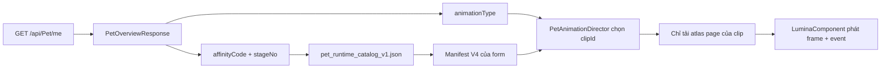

# Hướng dẫn tích hợp Pet Animation V7.2 vào Walkamon

## 1. Trạng thái gói asset

Gói candidate đã nằm trong:

```text
assets/Mobile/flame/pet_runtime_v7_2/
```

Các file điều phối:

| File | Mục đích |
|---|---|
| `pet_runtime_catalog_v1.json` | Ánh xạ `affinityCode + stageNo` tới manifest của form |
| `pet_animations_v4.json` | Manifest kết hợp cả 7 form/stage, dùng cho parser test và sandbox |
| `manifest_<form>_v4.json` | Manifest riêng của từng form/stage |
| `package_report.json` | Số clip, số atlas page, dung lượng và nguồn candidate |
| `atlas_<sha256>.png` | Atlas page được đặt tên theo checksum để tránh trùng |
| `fallback_<form>_<sha256>.png` | Ảnh tĩnh dùng khi manifest/atlas lỗi |

Gói hiện có:

- Mầm Non Stage 0: 66 clip.
- Nắng Ấm Stage 1–2: 84 clip/stage.
- Bình Minh Stage 1–2: 84 clip/stage.
- Ánh Trăng Stage 1–2: 84 clip/stage.
- Tổng cộng: 570 clip, 856 atlas page.
- Ánh Trăng Stage 2 dùng bản V7.2 sắc nét.

`pubspec.yaml` **chưa khai báo** thư mục asset master này và game chưa trỏ sang
manifest mới. Vì vậy asset được lưu trong repo để review/chuẩn bị production
pack nhưng không bị nhét thẳng 2,36 GiB vào APK/AAB hiện tại.

> Các PNG trong gói local là NTFS hard-link tới candidate đã duyệt để không
> chiếm thêm khoảng 2,4 GiB trên ổ C. Flutter và Git đọc chúng như file bình
> thường. Khi clone/copy repo sang máy khác, chúng trở thành file độc lập.

## 2. Cấu trúc DB hiện tại từ `FINAlFINAL.sql`

Nguồn đã kiểm tra:

```text
C:\Đồ Án\walkamon_backend\Database\FINAlFINAL.sql
```

Các bảng liên quan:

### `pets`

```text
pet_id
pet_name
pvp_affinity_code
life_force / energy / bond / exp
...rate
```

`pvp_affinity_code` là khóa hình ảnh chính và hiện hỗ trợ:

```text
sprout
warm_sun
dawn
moonlight
```

### `pet_stages`

```text
stage_id
pet_id
state_url
stage_no
stage_name
required_level
is_active
```

DB có unique index trên `(pet_id, stage_no)`.

### `pet_animations`

```text
pet_animation_id
pet_id
animation_url
type_animation
pet_stage_use
is_active
```

Bảng này là contract legacy, chỉ mô tả animation ở mức coarse state. Nó không
có `clipId`, frame rectangle, atlas page, event, duration hoặc return policy.

### `user_pets`

```text
user_id
pet_id
level
pet_name
pet_exp
current_pet_exp
current_pet_energy
current_pet_bond
current_pet_life_force
```

`user_pets` xác định pet hiện tại của user. Stage hiện tại được suy ra từ
evolution history/stage của pet.

## 3. Contract API nên dùng

Client nên dùng:

```http
GET /api/Pet/me
```

`PetOverviewResponse` hiện đã trả đủ dữ liệu chọn asset:

```json
{
  "petId": "...",
  "affinityCode": "warm_sun",
  "stageNo": 2,
  "animationType": "happy"
}
```

Backend hiện tính `animationType` như sau:

| Điều kiện | `animationType` |
|---|---|
| Energy ≤ 20% | `sleep` |
| Life Force ≤ 20% | `hungry` |
| Bond ≤ 20% | `sad` |
| Cả ba ≥ 80% | `happy` |
| Còn lại | `idle` |

Không cần gọi `GET /api/Pet/current-animation` để chọn atlas local. Endpoint
đó đọc `pet_animations.animation_url`, phù hợp với contract URL cũ hơn là asset
bundle mới.

Không cần thêm 570 record vào SQL. DB chỉ chọn:

```text
affinityCode + stageNo + animationType
```

Client manifest chọn clip variant, frame, page, duration và event.

## 4. Ánh xạ DB → asset

| `pets.pvp_affinity_code` | Stage phía client | Catalog key |
|---|---:|---|
| `sprout` | Luôn ép về `0` | `sprout_stage0` |
| `warm_sun` | Clamp `1..2` | `warm_sun_stage1/2` |
| `dawn` | Clamp `1..2` | `dawn_stage1/2` |
| `moonlight` | Clamp `1..2` | `moonlight_stage1/2` |

Việc ép Mầm Non về Stage 0 đã tồn tại trong
`PetVisualSnapshot.fromPet`. Nó giúp tách starter form khỏi Stage 1–2 của các
hệ tiến hóa, kể cả khi DB trả stage đầu tiên là `1`.



## 5. Tình trạng code Flame hiện tại

Các file chính:

```text
lib/game/pet_scene/pet_animation_manifest.dart
lib/game/pet_scene/pet_animation_director.dart
lib/game/pet_scene/pet_scene_game.dart
lib/game/pet_scene/pet_scene_widget.dart
lib/data/models/pet_overview_response.dart
```

Điểm đã tương thích:

- `PetAnimationCatalog` đọc manifest Version 2, 3 và 4.
- Page path bắt đầu bằng `assets/` được giữ nguyên.
- Frame đã hỗ trợ page, rectangle, original size, offset, pivot và duration.
- Event đã hỗ trợ `food_consume`, `swallow`, `delicious`, `sparkle`,
  `foot_land`, v.v.
- One-shot đã có `onComplete` và quay về base state.
- Full-body crossfade đã bị tắt để tránh mắt/chi kép.
- Asset cache có LRU.

## 6. Blocker bắt buộc trước khi bật production

Gói trong repo là **master candidate chất lượng cao**, chưa phải texture pack
tối ưu cho điện thoại.

Hiện tại:

- `PetSceneGame._maxTexturePages = 5`.
- Một số clip master dùng tới 53 page.
- Tổng PNG nén khoảng 2,35 GiB.
- Nếu giải nén toàn bộ page vào GPU sẽ cần khoảng 11,1 GiB RAM texture.

Không được chỉ đổi:

```dart
PetAnimationCatalog.manifestAsset
```

sang manifest mới rồi phát hành. `_loadClip` hiện tải toàn bộ page của clip;
clip 53 page có thể dùng hàng trăm MiB RAM và làm app bị kill.

### Bản production cần tạo

Từ master candidate, sinh thêm gói `pet_runtime_prod_v1`:

1. Giữ timeline 60 Hz nhưng chỉ giữ tối đa 30 drawing thật/giây.
2. Gộp hold bằng `duration`, không nhân bản texture.
3. Repack riêng từng clip sau khi giảm drawing.
4. Mục tiêu tối đa 5 page/clip ở 512 px.
5. Nếu vẫn quá 5 page, downsample atlas riêng cho Home xuống 384 hoặc 256 px;
   source master 512 px vẫn được giữ cho Spirit Detail.
6. Không preload cả form. Chỉ preload `idle_front` và action sắp chạy.
7. Giữ LRU 5 page cho Home; đo lại trên Android thật.

Ví dụ clip 2,4 giây:

```text
Master 60 drawing/s: 144 drawing
Production 30 drawing/s: 72 drawing
Atlas 512 px, 2048 page: tối đa khoảng 16 drawing/page
Kết quả mục tiêu: 5 page
```

Đây là bước tối ưu đóng gói, không thay đổi artwork đã duyệt.

## 7. Cách tích hợp sau khi có production pack

### Bước 1 — thêm constant manifest

Trong `PetAnimationCatalog`:

```dart
static const runtimeV1ManifestAsset =
    'assets/Mobile/flame/pet_runtime_prod_v1/pet_animations_v4.json';
```

Giai đoạn đầu có thể dùng manifest kết hợp để không phải reload catalog khi
evolution đổi form. Khi startup time cần tối ưu, chuyển sang manifest theo form
và reload catalog sau khi identity đổi.

### Bước 2 — bật bằng feature flag

Không thay default ngay. Thêm flag:

```dart
const bool usePetRuntimeV1 = bool.fromEnvironment(
  'USE_PET_RUNTIME_V1',
  defaultValue: false,
);
```

Sau đó truyền `animationManifestAsset` vào `PetSceneWidget`.

### Bước 3 — bỏ renderer Sprout procedural khi dùng atlas

`_usesSproutPuppet` hiện chỉ true khi dùng manifest legacy mặc định. Khi truyền
manifest V4 mới, Mầm Non tự đi qua full-body atlas; không cần sửa API.

### Bước 4 — chọn state và clip

State coarse từ server:

| Server state | Clip base |
|---|---|
| `idle` | `idle_front` |
| `happy` | `happy` hoặc variant happy theo director |
| `excited` | `excited_enter → excited_loop → excited_exit` |
| `hungry` | `hungry_enter → hungry_loop` |
| `sad` | `sad_enter → sad_loop` |
| `sleep` | `sleep_enter → sleep_loop`; khi tỉnh chạy `sleep_wakeup` |
| Tap API thành công | `tap_hello`/variant vùng chạm |
| Feed API thành công | `feed_notice → feed_eat → feed_delicious → feed_finish` |

Nếu một `clipId` không tồn tại, `PetAnimationCatalog.resolve` phải fallback theo
`semanticState`, sau đó `idle`, cuối cùng `idle_front`.

### Bước 5 — action lock

Giữ quy tắc:

```text
API request đang chạy
→ khóa tap/feed tiếp theo
→ API thành công mới phát success animation
→ one-shot không bị polling server cắt ngang
→ onComplete xử lý returnPolicy
→ refresh overview sau action
```

API lỗi chỉ phát press effect nhẹ, không phát animation thành công.

### Bước 6 — event

Event phải phát đúng một lần theo frame index:

```text
food_consume
swallow
delicious
sparkle
heart
tear
dream
wakeup
```

Khi pause/resume, giữ `_frameIndex`, `_frameElapsed` và tập event đã emit;
không phát lại `food_consume`.

## 8. Tối ưu cache

Không tính giới hạn theo số clip; tính theo page đang decode.

```text
Protected:
- page đang hiển thị
- page kế tiếp của action đang chạy

Evict:
- page LRU ngoài identity hiện tại
- page của action đã hoàn tất

Preload:
- idle_front
- action người dùng vừa bắt đầu
```

Khi đổi `(affinityCode, stageNo)`:

1. Tăng generation token.
2. Bỏ kết quả async thuộc identity cũ.
3. Clear clip map của form cũ.
4. Preload fallback + `idle_front` form mới.
5. Chỉ swap sau khi frame đầu đã sẵn sàng.

## 9. Kiểm thử bắt buộc

### Parser/asset

- Catalog có đúng 7 form/stage.
- Manifest kết hợp có đúng 570 clip.
- Mọi page/fallback tồn tại trong Flutter AssetManifest.
- Frame page index hợp lệ.
- Rect dương, pivot trong `0..1`, duration > 0.

### Runtime

- Resolve đủ 4 affinity và stage tương ứng.
- Resize 128/180/256/512 px không trôi pivot.
- Idle không restart khi EXP, bước hoặc stats thay đổi.
- Tap/feed liên tục chỉ gửi một request.
- Pause/resume không reset clip và không phát lại event.
- One-shot hoàn tất quay về đúng base state.
- Sleep giữ loop/pose đúng khi app pause.
- Evolution không hiển thị frame của form cũ sau swap.
- Cache không vượt budget.

### Hiệu năng Android

- Test profile/release, không dùng debug FPS làm chuẩn.
- Frame time p95 ≤16,7 ms.
- Không spike khi chuyển idle → action.
- Theo dõi `adb shell dumpsys meminfo` trước/sau 50 action.
- RAM không tăng liên tục và app không reload texture ngoài ý muốn.

## 10. SQL kiểm tra ánh xạ, không sửa dữ liệu

```sql
SELECT
    p.pet_id,
    p.pet_name,
    p.pvp_affinity_code,
    ps.stage_no,
    ps.stage_name,
    pa.type_animation,
    pa.pet_stage_use,
    pa.animation_url
FROM pets p
LEFT JOIN pet_stages ps
    ON ps.pet_id = p.pet_id
   AND ps.is_active = 1
LEFT JOIN pet_animations pa
    ON pa.pet_id = p.pet_id
   AND pa.pet_stage_use = ps.stage_no
   AND pa.is_active = 1
ORDER BY
    p.pvp_affinity_code,
    ps.stage_no,
    pa.type_animation;
```

Không cần cập nhật `animation_url` cho bundle local. Nếu giữ endpoint
`current-animation`, tiếp tục xem nó là legacy/fallback. Nguồn chọn hình chính
của mobile là `/api/Pet/me` + catalog local.

## 11. Lệnh tái tạo và kiểm tra gói master

```powershell
cd C:\walkamon_mobile
python tool\package_pet_runtime_assets_v7_2.py --check
```

Script mặc định chỉ tạo mới khi thư mục output chưa tồn tại; nó không tự xóa
hoặc ghi đè thư mục asset đã đóng gói.

## 12. Thứ tự triển khai an toàn

1. Giữ nguyên gói V7.2 master trong repo.
2. Sinh `pet_runtime_prod_v1` tối đa 5 page/clip.
3. Chạy parser test và asset test.
4. Tích hợp bằng feature flag mặc định off.
5. Test Home + Spirit Detail trên Android profile.
6. Bật nội bộ cho một form trước, ưu tiên Mầm Non.
7. Theo dõi RAM/FPS.
8. Bật lần lượt sáu stage còn lại.
9. Chỉ sau nghiệm thu mới đổi default manifest.
